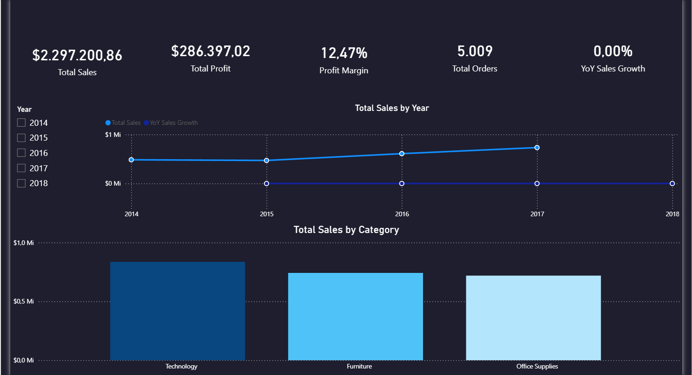
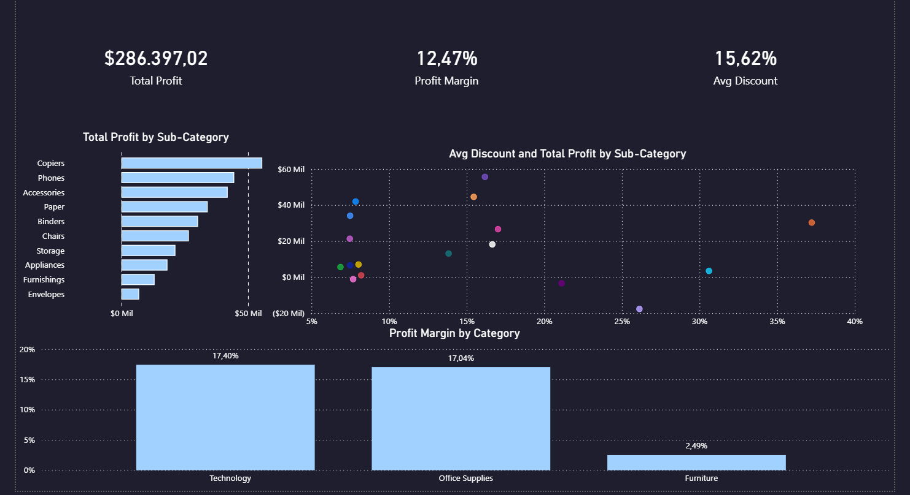
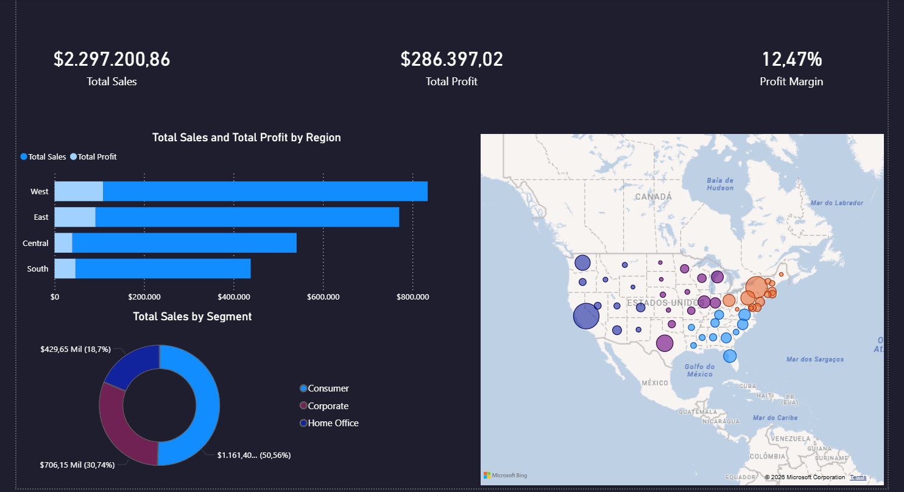

# Retail Sales Performance Dashboard (Power BI)

## Project Overview
This project delivers an end-to-end Business Intelligence solution for a fictional US retail chain (Superstore), using Power BI to analyze sales performance, profitability, and customer behavior across regions and product categories.

The goal was to answer key business questions that a real retail analyst would face — identifying where the business makes money, where it loses, and what drives growth.

---

## Dataset
- **Source:** [Superstore Sales Dataset – Kaggle](https://www.kaggle.com/datasets/vivek468/superstore-dataset-final)
- **Scope:** 5,009 orders across 4 years (2014–2017), covering 3 product categories and 4 US regions.
- **Note:** The full dataset is located in the `/data` folder.

---

## Dashboard File
The full interactive dashboard is available in this repository:
[Download the .pbix file](Portfolio.pbix)

---

## Tools & Technologies
- Power BI Desktop
- Power Query (M Language) — data cleaning and transformation
- DAX — calculated measures and time intelligence
- Star Schema — data modeling

---

## Process
1. Data import and regional settings adjustment (English US)
2. Data cleaning and transformation using Power Query
3. Star Schema modeling with 4 dimension tables + 1 fact table
4. Calendar table creation using DAX CALENDAR function
5. DAX measures development 
6. Dashboard design across 3 analytical pages
   
---

## Data Modeling

The raw dataset was a single flat CSV file. Using Power Query, it was split into a proper **Star Schema** with 5 tables:

```
fOrders (fact)
│
├── dProducts   → Product ID, Category, Sub-Category, Product Name
|── dCustomers  → Customer ID, Customer Name, Segment
├── dLocation   → Postal Code, City, State, Region
└── dCalendar   → Date, Year, Month, Quarter (built with DAX CALENDAR function)
```

**Key modeling decisions:**
- Regional settings adjusted to English (United States) to ensure correct date and decimal parsing
- Duplicates removed from all dimension tables to enforce One-to-Many relationships
- Calendar table built using DAX CALENDAR function, extended with Year, Month, Quarter and Month Name calculated columns
- A dedicated `_Measures` table was created to centralize all DAX measures

---

## DAX Measures

| Measure | Description |
|---|---|
| Total Sales | SUM of all order revenue |
| Total Profit | SUM of all order profit |
| Total Orders | DISTINCTCOUNT of Order ID |
| Total Quantity | SUM of units sold |
| Profit Margin | DIVIDE(Total Profit, Total Sales) |
| Average Order Value | DIVIDE(Total Sales, Total Orders) |
| Avg Discount | Average discount rate across all orders |
| YoY Sales Growth | Year-over-Year growth using SAMEPERIODLASTYEAR |
| Running Total Sales | Year-to-date accumulation using DATESYTD |

---

## Business Questions

This project was designed to answer 9 key business questions across 3 analytical dimensions.

### Page 1 — Executive Overview
1. What is the overall revenue and profitability of the business?
2. How has revenue trended over the years?
3. Which product category generates the most revenue — and is it also the most profitable?

### Page 2 — Product Performance
4. Which sub-categories are the most profitable, and what drives their margins?
5. Does offering higher discounts hurt profitability?
6. Although Technology and Office Supplies share similar overall margins, which category is more consistent and capital-efficient?

### Page 3 — Regional Analysis
7. West leads in both sales and profit — but is it also more margin-efficient than other regions?
8. Which states are the strongest markets — and are high-sales states also high-profit?
9. Consumer segment dominates revenue at 50% — but is it the most profitable segment?

---

## Dashboard Preview

### Page 1 — Executive Overview


### Page 2 — Product Performance


### Page 3 — Regional Analysis


---

## Key Insights

### Executive Overview
- The business generated **$2.30M in revenue** and **$286K in profit** with an overall margin of **12.47%** across 5,009 orders.
- Revenue declined slightly from 2014 to 2015, then grew consistently through 2017. The 2018 data is incomplete, representing only a partial year.
- **Technology leads in both revenue ($836K) and profitability**, while Furniture generates $742K in sales but only $18K in profit — nearly 8x less than Technology despite similar sales volume.

### Product Performance
- **Copiers is the most efficient sub-category**, delivering a 37.20% profit margin with only 16.20% average discount — the highest absolute profit in the entire portfolio.
- **Accessories demonstrates strong pricing power**: with the lowest discount rate (7.85%), it maintains a 25% profit margin — proving it doesn't need discounting to sell.
- **Tables and Bookcases operate at a loss**: Tables at -8.56% margin (26% avg discount) and Bookcases at -3% margin (21% avg discount). These two sub-categories are the primary driver of Furniture's poor overall performance.
- Although Technology and Office Supplies share a similar overall margin (~17%), Technology achieves this across only 4 sub-categories — all profitable. Office Supplies carries the "Supplies" sub-category at -2.55% margin, indicating portfolio inefficiency.

### Regional Analysis
- **West leads in both volume and margin efficiency** (14.94%), proving it is not just a high-volume region but also a high-quality revenue generator. Central Region underperforms at only 7.92% margin.
- **California dominates in volume ($457K) but Washington is more capital-efficient** (24% margin vs 16.7%). Colorado and Arizona are generating revenue while operating at a loss (-20.33% and -9.7% respectively) — suggesting pricing or discount problems that require immediate attention.
- **Consumer segment drives 50% of revenue but has the lowest margin (11.55%)**. Home Office, despite being the smallest segment at 18.7% of sales, delivers the highest margin at 14% — indicating these customers are less price-sensitive and more profitable per dollar sold.

---

## Strategic Recommendations
- **Furniture pricing review:** Tables and Bookcases should have discount caps implemented — operating at a loss is unsustainable.
- **Colorado and Arizona investigation:** These markets are losing money despite generating sales. A regional pricing or discount audit is recommended.
- **Home Office growth opportunity:** Despite being the smallest segment, Home Office customers are the most profitable. Targeted marketing investment in this segment could improve overall margins.
- **Replicate West Region strategy:** West's combination of high volume and strong margin suggests operational or pricing practices worth replicating in Central and South regions.
